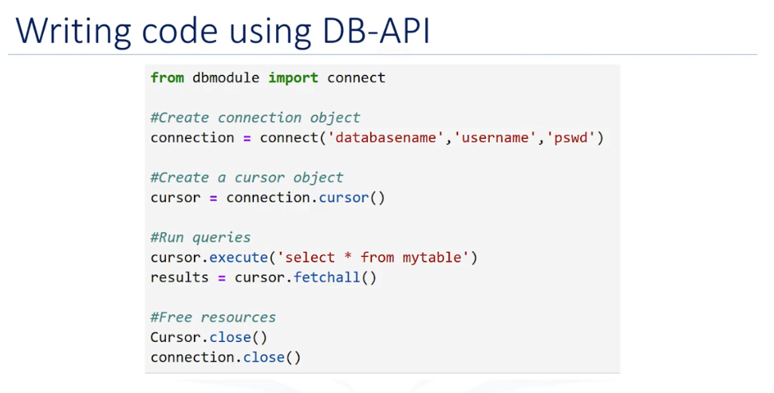

[Principal](../README.md) 

# MysqlDb

## MYSQL Instalacion:

    brew install mysql
    brew cleanup
    brew tap homebrew/services
    brew services start mysql
    mysql -V
    mysqladmin -u root password 'unapasswdsegura'

## importacion de librería connector:
    import mysql.connector

## mysql.conector.conect:
      mydb = mysql.connector.connect(
        host="localhost",
        user="root",
        passwd="very_strong_password",
        database="prueba_db",
        auth_plugin='mysql_native_password')

## conection y cursor:
        mydb = conection.mydb
        cursor = self.mydb.cursor()
        

## consulta selct, fetchall():
cursor.fetchall()recupera todas las filas del resultado de una consulta. Devuelve todas las filas como una lista de tuplas. Se devuelve una lista vacía si no hay ningún registro que recuperar.

    self.cursor.execute("select * from "+tableName)
        fname = self.cursor.fetchall()
        for data in fname:
            for val in data:
                print(val)
        self.mydb.commit()
        
### consulta selct, fetchmany(size):
cursor.fetchmany(size)devuelve el número de filas especificado por el argumento de tamaño. Cuando se llama repetidamente, este método obtiene el siguiente conjunto de filas del resultado de una consulta y devuelve una lista de tuplas. Si no hay más filas disponibles, devuelve una lista vacía.

    self.cursor.execute("select * from "+tableName)
        fname = self.cursor.fetchmany(2)
        for data in fname:
            for val in data:
                print(val)
        self.mydb.commit()

### consulta select, fetchone():
cursor.fetchone() El método devuelve un solo registro o Ninguno si no hay más filas disponibles.

    self.cursor.execute("select * from "+tableName)
        fname = self.cursor.fetchone()
        for data in fname:
            for val in data:
                print(val)
        self.mydb.commit()

### Mas:
### craer una database
    cursor.execute("CREATE DATABASE " + DBname)
### ver las databases existentes
    cursor.execute("show databases")
### eliminar una database
    cursor.execute("drop database "+ DBname)
### crear table
    cursor.execute("CREATE TABLE users (name VARCHAR(255), user_name VARCHAR(255))")
### actualizacion
    cursor.execute("UPDATE users SET name = 'Kareem' WHERE id = 1")

[Subir](#top)
