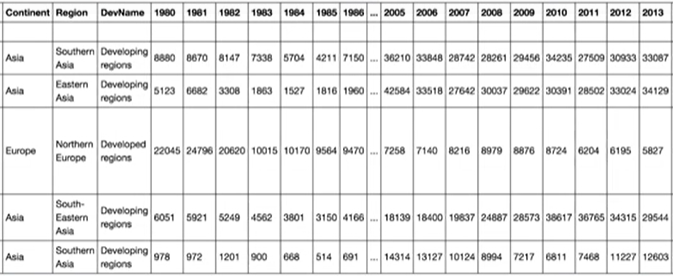
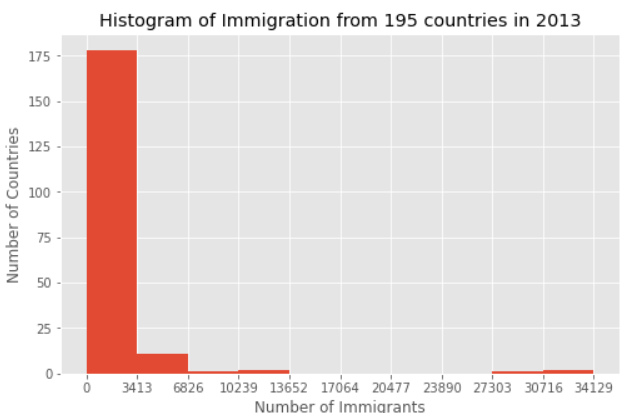

# Visualizacion de datos
 Pandas: <http://pandas.pydata.org/pandas-docs/stable/generated/pandas.Series.plot.html>
### Tipo de gráficos:
1) Gráfico de área
2) Gráfico de histogramas
3) Gráficos de barras
4) Gráficos bar_chart

#### Gráfico de área:
Los gráficos de área se utilizan para mostrar el desarrollo de valores cuantitativos a lo largo de un intervalo o período de tiempo.
 **Ejemplo:** 
vamos a mostrar tanto los cinco paises que más contribuyen con la imigración como los que menos contibuyen:
Conjunto de Datos: Inmigración en Canadá desde 1980 a 2013 – Flujos migratorios internacionales a y desde los países seleccionados – Revisión de 2015 del portal de la ONU.
##### TAREAS GENERICAS
##### 1) Importamos las librerías necesarias:
    import matplotlib as mpl
    import matplotlib.pyplot as plt
    import numpy as np  # muy útil para cálculos científicos con Python
    import pandas as pd # Librería para estructar datos primarios
    
##### 2) Obtenemos el dataset deprueba (como se puede observar es de tipo excel):
    df_can = pd.read_excel('https://s3-api.us-geo.objectstorage.softlayer.net/cf-courses-   data/CognitiveClass/DV0101EN/labs/Data_Files/Canada.xlsx',
                       sheet_name='Canada by Citizenship',
                       skiprows=range(20),
                       skipfooter=2
                      )

    print('Data downloaded and read into a dataframe!')

##### 3) Imprimir el tamaño del DataFrame
    print(df_can.shape)

##### 4) Limpiar el conjunto de datos para borrar las columnas que no ofrecen información en nuestra visualización
    df_can.drop(['AREA', 'REG', 'DEV', 'Type', 'Coverage'], axis=1, inplace=True)
    
##### 5) Veamos los primeros cinco elementos para ver como cambió el DataFrame
    df_can.head()
    
 

###### 6) cambiar los nombres de las columnas
    df_can.rename(columns={'OdName':'Country', 'AreaName':'Continent','RegName':'Region'}, inplace=True)
    df_can.head()

 

##### 7) Revisar el tipo de dato de las etiquetas de las columnas todas deben ser de tipo cadena
mostrará true si son de tipo cadena y false si no

    all(isinstance(column, str) for column in df_can.columns)
    
convertimos a tipo cadena

    df_can.columns = list(map(str, df_can.columns))

Revisemos el ahora el tipo de dato en los nombres de las columnas

    all(isinstance(column, str) for column in df_can.columns)

##### Cambiamos los indices por country y añadimos la columna total:
    df_can.set_index('Country', inplace=True)
    df_can['Total'] = df_can.sum(axis=1)
    df_can.head()
    
 

### DIAGRAMA DE ÁREA:
#### paises que más contribuyen
##### Obtenemos la lista de años dese 1980 a 2014
     years = list(map(str,range(1980,2014)))
     
##### Ordenadmos los datos de la columna total, sort_values()
    df_can.sort_values(['Total'], ascending=False, axis=0, inplace=True)
   
##### Obtenemos los cinco primeros valores, head()
    df_top5 = df_can.head()
  
##### transponer el DataFrame (vertical to horizontal)
    df_top5 = df_top5[years].transpose() 
    df_top5.head()
 
       
##### cambiar el valor de los índices de df_top5 a tipo entero para graficarlos
    df_top5.index = df_top5.index.map(int)
    
##### generamos el tipo de gráfico capa de Scripting (método procedural)
    df_top5.plot(kind='area', 
             alpha=0.25,   #0-1, valor por defecto a 0.5
             stacked=False,   #Para crear una grafica no apilada estableceremos stacked=False.
             figsize=(20, 10), # pasar el tamaño de tupla (x, y)
             )
             
##### Pintamos el gráfico y lo mostramos capa de Scripting (método procedural)

    plt.title('Immigration Trend of Top 5 Countries')
    plt.ylabel('Number of Immigrants')
    plt.xlabel('Years')

    plt.show()
    

##### Pintamos el gráfico y lo mostramos Capa de Artista  (método orientado a objetos)
generamos el tipo de gráfico  capa de Scripting (método procedural)
    
    ax = df_top5.plot(kind='area', alpha=0.35, figsize=(20, 10))

Pintamos el gráfico capa de Scripting (método procedural)
    
    ax.set_title('Immigration Trend of Top 5 Countries')
    ax.set_ylabel('Number of Immigrants')
    ax.set_xlabel('Years')
    

### Mostrar los cinco paises que menos contribuyen con la imigración
##### Obtenemos los cinco primeros valores, head()
    df_least5 = df_can.tail(5)
    
##### Transpose the dataframe
    df_least5 = df_least5[years].transpose() 
    df_least5.head()
    
##### Cambiar el valor de los índices de df_top5 a tipo entero para graficarlos
    df_least5.index = df_least5.index.map(int)
    df_least5 = df_least5.plot(kind='area', alpha=0.55, stacked=False, figsize=(20, 10))

##### Pintamos la gráfica
    plt.title('Immigration Trend of 5 Countries with Least Contribution to Immigration')
    plt.ylabel('Number of Immigrants')
    plt.xlabel('Years')

    plt.show()

#### HISTOGRAMAS:
Un histograma representa la distribución de frecuencia de un conjunto de datos numéricos. La forma en que trabaja es dividiendo el eje x en contenedores y asignando cada dato dentro del conjunto a uno de ellos para después contar el numero de datos asignado a cada contenedor. De esta forma el eje y es la frecuencia o el numero de datos en cada contenedor.
 **Ejemplo:** 
¿Cuál es la distribución de frecuencias de la cantidad de inmigrantes provenientes de distintos países hacia Canadá en 2013?
**Nota:** Primero devemos dividir los datos en intervalos. Para esto, usaremos el método histrogram de Numpy para obtener el rango de los contenedores y el conteo de frecuencias.
    
# revisar rapidamente los datos de 2013 
    df_can['2013'].head()

# np.histogram regresa 2 valores
    count, bin_edges = np.histogram(df_can['2013'])

    print(count) # conteo de las frecuencias
    print(bin_edges) # rango de los contenedores, por defecto son 10 contenedores
    

**Nota:** Por defecto, el método histrogram divide el conjunto de datos en 10 contenedores.

##### Pintamos la gráfica (las columnas salen descentradas)
    df_can['2013'].plot(kind='hist', figsize=(8, 5))

    plt.title('Imigración 195 paises en 2013') # añade un titulo al histograma
    plt.ylabel('Número de paises') # añadir etiqueta de y
    plt.xlabel('Número de imigrantes') # añadir etiqueta de x

    plt.show()
    

**Nota:** Obsérvese que las etiquetas del eje x no corresponden con el tamaño del contenedor. Esto se soluciona pasando una palabra xticks que contenga la lista de los tamaños de los contenedores como se explica a continuación:

##### Pintamos la gráfica con las columnas centradas (xticks=bin_edges)
'bin_edges' es una lista de los intervalos de los contenedores 

    count, bin_edges = np.histogram(df_can['2013'])
    df_can['2013'].plot(kind='hist', figsize=(8, 5), xticks=bin_edges)

    plt.title('Imigración 195 paises en 2013') # añade un titulo al histograma
    plt.ylabel('Número de paises') # añadir etiqueta de y
    plt.xlabel('Número de imigrantes') # añadir etiqueta de x

    plt.show()

¿Cual es la distribución de la inmigración en Dinamarca, Noruega y Suecia desde 1980 a 2013?

    df_can.loc[['Denmark', 'Norway', 'Sweden'], years]
    
 
 
##### Generamos el histograma:
# Obtener los datos y trasponerlos
    df_t = df_can.loc[['Denmark', 'Norway', 'Sweden'], years].transpose()
    df_t.head()
    
# generar el histograma
    df_t.plot(kind='hist', figsize=(10, 6))

    plt.title('Histogram of Immigration from Denmark, Norway, and Sweden from 1980 - 2013')
    plt.ylabel('Number of Years')
    plt.xlabel('Number of Immigrants')

    plt.show()
    

**Nota:** El resultado no es muy fino dado que sale apilado, por lo que vamos a realizar las siguientes modificaciones para que se vea bien:
* Incrementar el tamaño de contenedor a 15 pasando el parámetro bins
* establecer una transparencia del 60% con el parámetro alpha
* etiquetar el eje x con el parámetro x-label
* cambiar el color de las graficas con el parámetro color

##### obtener los valores de x
    count, bin_edges = np.histogram(df_t, 15)

##### generar el histograma
    df_t.plot(kind ='hist', 
          figsize=(10, 6),
          bins=15,
          alpha=0.6,
          xticks=bin_edges,
          color=['coral', 'darkslateblue', 'mediumseagreen']
         )

    plt.title('Histogram of Immigration from Denmark, Norway, and Sweden from 1980 - 2013')
    plt.ylabel('Number of Years')
    plt.xlabel('Number of Immigrants')

    plt.show()

#### DIAGRAMA DE BARRAS:
La grafica de barras es una manera de representación de datos donde la longitud de las barras muestran la magnitud/tamaño de una característica/variable. Estas graficas usualmente representan de forma numérica y por categoría, variables agrupadas en intervalos.

Para crear una grafica de barras tenemos que pasar uno o dos argumentos mediante el parámetro kind en la función plot():

* kind=bar crea una grafica de barras verticales
* kind=barh crea una grafica de barras horizontales

**Grafica de Barras Verticales

En las graficas de barras verticales, el eje x se usa para el etiquetado y la longitud de las barras en el eje y corresponde a la magnitud de la variable utilizada. Estas graficas son particularmente útiles en el análisis para series de datos de tiempo. Una desventaja es que carecen de espacio para añadir una etiqueta al pie de cada barra.

**Efecto de la Crisis Financiera de Islandia:**
De 2008 a 2011 la crisis financiera de Islandia fue el mayor evento económico y político de ese país. En relación con el tamaño de su economía, el colapso de sistema bancario de Islandia fue el mas grande experimentado por cualquier en la historia de la economía. La crisis llevó a una severa depresión económica de 2008 a 2011 y una significante agitación política.

Comparación del número de inmigrantes Islandeses a Canadá durante el periodo de 1980 a 2013.
##### paso 1: obtener los datos
    df_iceland = df_can.loc['Iceland', years]
    df_iceland.head()

##### # paso 2: graficar los datos
    df_iceland.plot(kind='bar', figsize=(10, 6))

    plt.xlabel('Year') # añadir etiquetado al eje x de la grafica
    plt.ylabel('Number of immigrants') # añadir etiquetado al eje y de la grafica
    plt.title('Icelandic immigrants to Canada from 1980 to 2013') # añadir un titulo a la grafica

    plt.show()
    

La grafica de barras de arriba muestra el numero total de inmigrantes divididos por año. Podemos ver claramente el impacto de la crisis financiera; el numero de inmigrantes hacia Canadá comenzó a incrementarse rápidamente después de 2008.

Anotemos esto en la grafica usando el método annotate de la capa de scripting o la interfaz pyploy. Pasaremos los siguientes parámetros:

* **s:** str, el texto de la anotación.
* **xy:** Tupla para especificar el punto (x,y) a ser anotado (en este caso, el punto final de la flecha).
* **xytext:** Tupla para especificar el punto (x,y) donde colocar el texto (en este caso, el punto inicial de la flecha)
* **xycoords:** El sistema de coordenadas xy dado - 'data' utiliza el sistema de coordenadas del objeto a ser anotado (por defecto).
* **arrowprops:** Toma un diccionario de propiedades para dibujar la flecha:
    - arrowstyle: Especifica el estilo de la flecha, '->' es la flecha estandar.
    - connectionstyle: Especifica el tipo de conexión. arc3 es una línea recta.
    - color: Especifica el color de la flecha.
    - lw: Especifica el ancho de la flecha.
